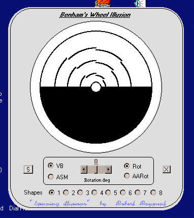



## Spinning Illusions

### Description

Spinning Illusions by Robert Rayment. (Small change, hopefully more stable on other OS than Win98) Just a bit of VB doodling, 8 shapes with odd effects. [ Shaped form & picbox, +/- rotation <-> anti-alias rotation, VB<->ASM, Res wav ]. Zip 100 KB, Win98.
 
### More Info
 
Just run

             |
---                |---
**Submitted On**   |2002-04-18 08:49:12
**By**             |[Robert Rayment](https://github.com/Planet-Source-Code/PSCIndex/blob/master/ByAuthor/robert-rayment.md)
**Level**          |Intermediate
**User Rating**    |4.9 (54 globes from 11 users)
**Compatibility**  |VB 6\.0
**Category**       |[Graphics](https://github.com/Planet-Source-Code/PSCIndex/blob/master/ByCategory/graphics__1-46.md)
**World**          |[Visual Basic](https://github.com/Planet-Source-Code/PSCIndex/blob/master/ByWorld/visual-basic.md)
**Archive File**   |[Spinning\_I731604182002\.zip](https://github.com/Planet-Source-Code/robert-rayment-spinning-illusions__1-33881/archive/master.zip)

### API Declarations

See code, several

